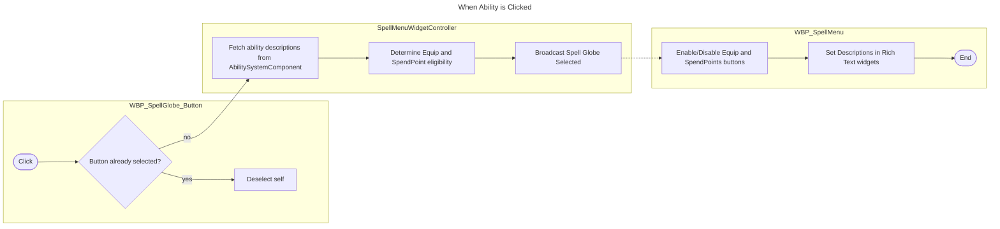
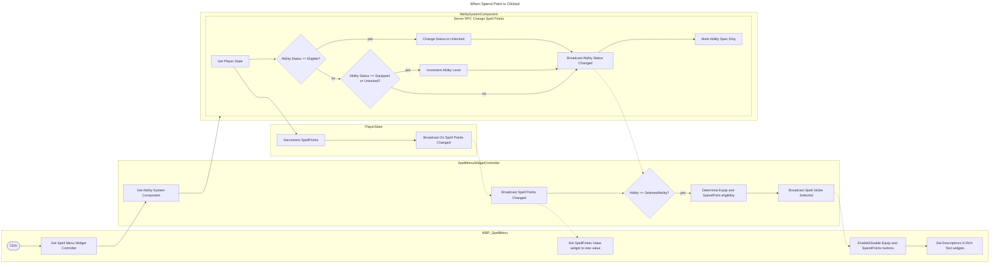
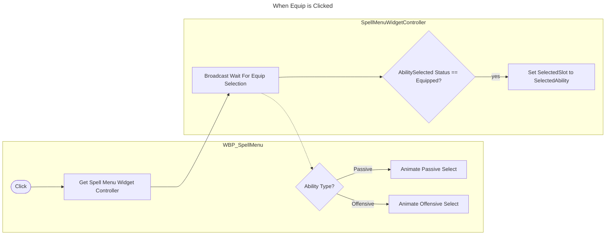
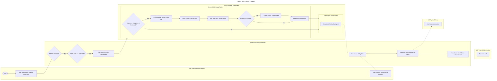

For my project [[June 2025/Aura|Aura]], which is all about learning Unreal Engine's Gameplay Ability System ( #GAS), the [course I was following](https://www.udemy.com/course/unreal-engine-5-gas-top-down-rpg) came to a point where progress with the ability system couldn't really be made until a Spell Menu was created to facilitate the development of certain features—such as equipping new abilities and assigning them to inputs. This menu is so detailed and complex, that its construction and implementation spanned **34 lessons** (almost 10%) of the course. Finishing it was a huge milestone, so I've uploaded a video of it in action.

> [!warning] Headphone Warning! 
> Some of the sound effects in this snippet are quite loud.

<iframe width="560" height="315" src="https://www.youtube-nocookie.com/embed/mjBAQQ68ty4?si=Aa9xe1tMwYusQvKP" title="YouTube video player" frameborder="0" allow="accelerometer; clipboard-write; encrypted-media; gyroscope; picture-in-picture; web-share" referrerpolicy="strict-origin-when-cross-origin" allowfullscreen></iframe>

In my experience, every project goes through a "trial-by-fire" at some point in development, and for me, this leg of the project was certainly it. My philosophy about UI tends to be, "If I'm going to do it, then I'm going to do it correctly and as cleanly as possible." Now, the UI code that we produced in this section was very robust, and I could probably write signatures and bind events to delegates in my sleep at this point, but when it came to actually constructing the UI with all of our subwidgets in the UMG editor... *the instructor and I have very different ideas of "clean"*. There was no end to the Wrap Boxes and Spacer widgets, and while I did my best to clean it up as I went along, polishing the layout of these widgets is definitely going on my list of TODOs. However, the main goal of the course is to learn GAS, not UI, and the rest of the course has been excellent so far, so I won't knock it too much.

Building this menu forced me to slow down, understand how the systems were wired together, and think more intentionally about how I want my code and UI to interact in future projects. It also made me realize just how often UIs in tutorials are treated as an afterthought, even when they’re doing heavy lifting for gameplay systems. 

I’m glad I stuck with it. There’s still polish work to be done, especially on the layout side, but the functional groundwork is solid. Above all else, it was a learning experience, and I'm ready to get to the rest of the course: making more cool abilities and exploring what GAS has to offer. 

Here's a simplified breakdown of how the menu works (flowcharts can be expanded in upper right corner):

