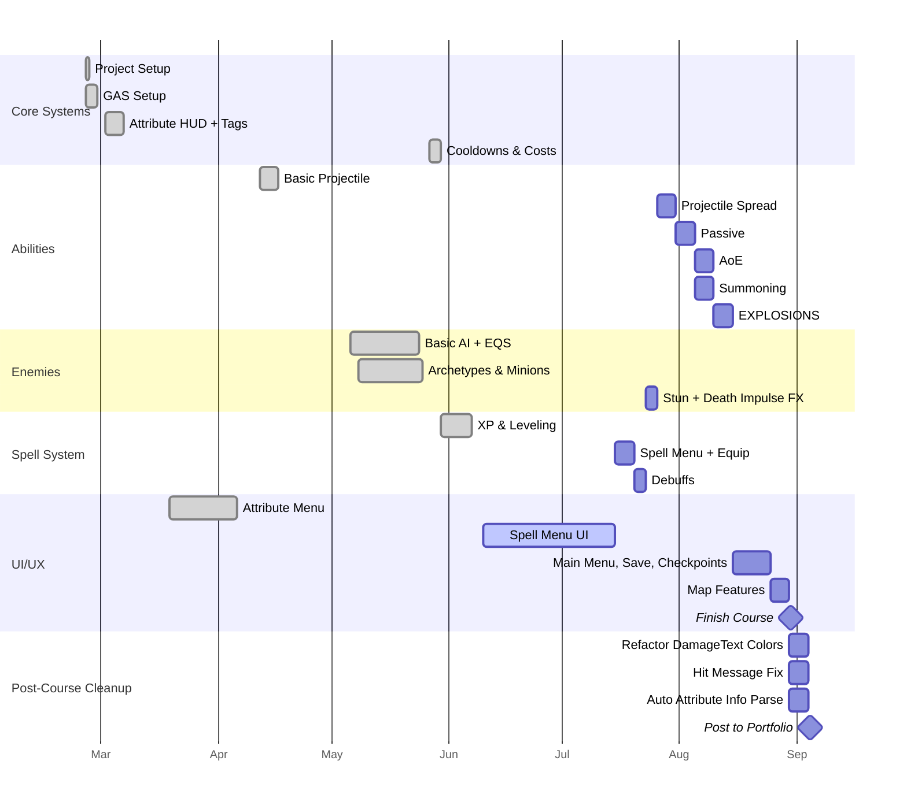

| Info                |                                                            |
| ------------------- | ---------------------------------------------------------- |
| **Project Title**   | *Aura*                                                     |
| **Project Type**    | *Game*                                                     |
| **Engine**          | *UE 5.3.2*                                                 |
| **Version Control** | *Diversion VC*                                             |
| **Repository**      | [request read-only access](mailto:ambrosecvetko@gmail.com) |
> [!info]
> *Aura* is a top-down action RPG built with C++ in UE5, designed to learn some of the engine's more complex systems such as GAS, Replication, AI (BT/EQS), and UI architecture (MVC/MVVM).

When I graduated from **Southern New Hampshire University** with a degree in *Game Programming and Development*, I knew I was far from done learning [[Gameplay Programming]].

That's not to say I knew *nothing*—far from it. I'd just spent 3 years developing in [[Unreal Engine]] and already had a solid foundation in C++. However, one of the downsides of a game programming–focused degree is that the curriculum will never really keep pace with the industry. Even if it somehow *could*, there just aren't enough teaching hours to learn every system that employers want to see on your resume (even for supposedly "entry-level" jobs... *sigh*).

Which is why I enrolled in an [Udemy course](https://www.udemy.com/course/unreal-engine-5-gas-top-down-rpg) to help myself learn Unreal Engine's **Gameplay Ability System (GAS)** immediately upon graduating from university. And *boy*—am I glad that I did because this course has taught me about *so* much more than just GAS. I now understand the difference between [[dedicated and listen servers]] and can implement UI using both MVC and MVVM. 

I'm still taking the course, so #Aura posts will document what I learn as I go along—the wins and any weirdness that pops up—but I already have ideas to improve and tweak the system after I'm finished, so I don't anticipate I'll ever be fully *done* with this project.
## Roadmap
> [!abstract]- Core Systems
>- [x] Project setup
>- [x] GAS: AbilitySystemComponent + AttributeSet
>- [x] Attribute Accessors macro
>- [x] Attribute HUD
>- [x] Gameplay Effects + Tags
>- [x] Attribute Menu + Point System
>- [x] XP on kill + Level Up UI
>- [x] Cooldown + Cost system

> [!abstract]- Abilities
>- [x] Basic Projectile
>- [ ] EXPLOSIONS
>- [ ] Projectile Spread
>- [ ] AoE
>- [ ] Passive Abilities
>- [ ] Summoning

> [!abstract]- Enemies
>- [x] Ranged logic via EQS
>- [x] Melee, Ranged, Summoner archetypes
>- [x] Minion spawn math (fun math)
>- [x] Death + despawn
>- [ ] Stun state
>- [ ] Death impulse FX

> [!abstract]- Spell System
>- [x] Award spell points on level up
>- [ ] Spell Menu (skill trees)
>- [ ] Equip Abilities from Spell Menu
>- [ ] Debuffs

> [!abstract]- UI / UX
>- [x] Attribute Menu
>- [ ] Spell Menu
>- [ ] Main Menu
>- [ ] Save System *(I've heard this is a cursed endeavor >.>)*
>- [ ] Map stuff™

> [!todo]- TODO: After the course
>- [ ] In function `GetColorBasedOnBlockandCrit` in `WBP_DamageText`, use bitmasks or enum and select node... anything but this mess:
>![[Images/Pasted image 20250627013634.png]]
>- [ ] Fix Hit Message code
>- [ ] Refactor mapping the tags to attributes (get rid of yucky map to function pointers and automate the population of `DA_AttributeInfo`)
### Timeline
