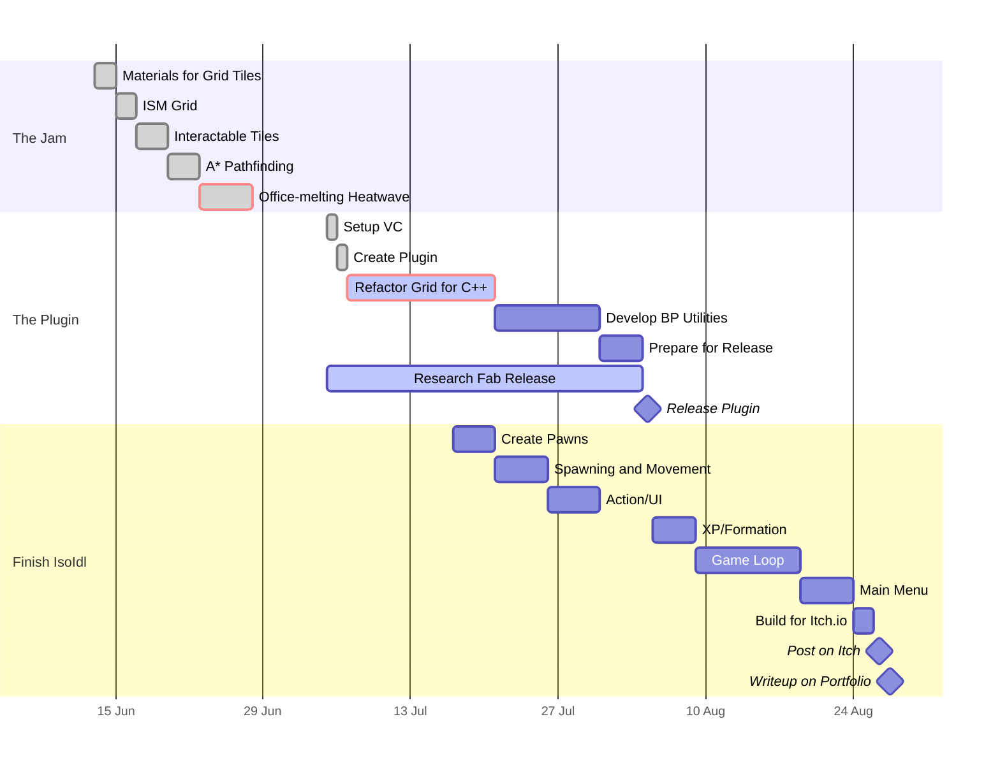

| Info                |                                                        |
| ------------------- | ------------------------------------------------------ |
| **Project Title**   | *IsoIdl* |
| **Project Type**    | *Plugin, Game*                                         |
| **Engine**          | *UE 5.5.4*                                             |
| **Version Control** | *none*                                                 |
| **Repository**      | *N/A*                                                  |
> [!info]
> *IsoIdl* is a turn-based strategy game made in UE5 using Blueprints. The grid-based elements (movement, tile generation, pathfinding, etc.) will eventually be made into a Plugin to release on Fab.

*IsoIdl* started as a game jam idea. Well—sort of. The truth is that I'd been wanting to make a turn-based strategy RPG for years but kept getting stuck on where to begin. RPGs are *a lot* to develop—especially if, like me, you have a tendency to really get into the weeds with characters and narrative structure.

So when a fellow SNHU alum started a game jam (theme: **Shape Science!!!**), I took it as my opportunity to finally start making progress. An sRPG is too complex? Better strip it down to the foundation, then: grid-based movement and pathfinding in a simpler project.

Despite a crazy confluence of events—raging allergies, a surprise job interview, and an office-melting heat wave—preventing me from finishing a playable game for the jam, I still made meaningful progress:

- Spawned a hex grid using an [[Instanced Static Mesh]]
- Controlled the individual tile colors with [[Custom Data Values]]
- Implemented a working [[A* Pathfinding]] algorithm

Before I go any further, my first challenge is to do it all again, but in C++ this time. This is crucial to the well-being of both my mental health and the project. I simply *cannot* maintain a pathfinding system written entirely in Blueprints. And, since I want to use this system in the future after finishing *IsoIdl*, on a project that will definitely be using C++, it will be much easier to write it as a C++ UE Plugin.
## Roadmap
> [!abstract]+ Port What I've Already Done To C++
>- [x] Create Plugin
>- [ ] Transfer `BP_Grid`
>- [ ] Transfer `BP_Pathfinding` (this should be made into an Actor component)

>[!abstract]+ Finish *IsoIdl*
> - [ ] Create pawns (should have a basic attribute set)
> - [ ] Spawn pawns according to grid
> - [ ] Grid-based movement
> - [ ] Create Actions and UI (move, attack, etc.)
> - [ ] Implement XP and level up system
> - [ ] Create formation system (shape science, baby!)
> - [ ] Define turn-based structure
> - [ ] Make main menu

### Timeline
